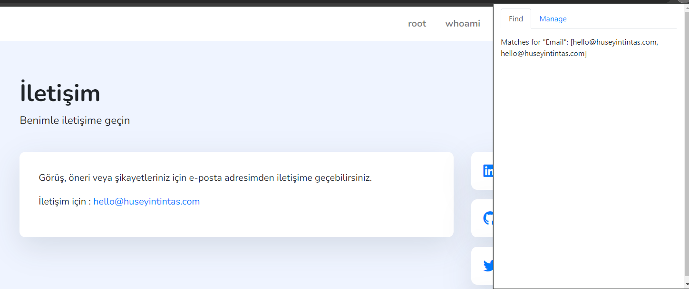
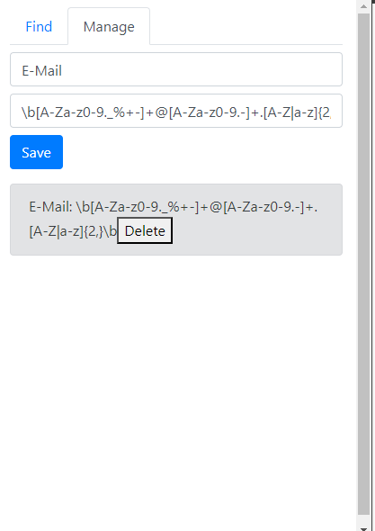

# Chrome Regex Scanner Extension

## Introduction
The Chrome Regex Scanner Extension is a versatile Chrome browser tool that enables users to scan web pages for specific patterns defined by regular expressions (regex). This extension is particularly useful for users who need to find, manage, and save complex text patterns within web content quickly.

## Features
- **Pattern Finder**: Use regex to scan and identify text patterns on any webpage.
- **Save and Manage Patterns**: Easily save regex patterns with custom names for future use.
- **Real-Time Scanning**: Perform live scans on webpages to find matches instantly.

## Installation
1. Clone this repository or download the ZIP file.
2. Open Chrome and navigate to `chrome://extensions`.
3. Enable "Developer mode" at the top right corner.
4. Click on "Load unpacked" and select the extension directory.

## Usage
After installation, the extension's icon will appear in your browser's toolbar. Click on it to open the popup interface where you can manage your regex patterns or find matches on the current page.

Here's how to use the extension with an example regex pattern for email addresses:

### Example: Finding Email Addresses
1. To find email addresses on a webpage, use the following regex pattern: `\b[A-Za-z0-9._%+-]+@[A-Za-z0-9.-]+\.[A-Z|a-z]{2,}\b`
2. Enter this pattern in the "Regex Pattern" input field and click "Save".
3. Navigate to a webpage and click on the extension icon.
4. Go to the "Find" tab to see email addresses.

### Managing Patterns
- Add, save, or delete regex patterns through the "Manage" tab for easy access and reuse.

## Screenshots
Here are some screenshots to help you navigate the extension:

### Finding Patterns

### Managing Patterns

## Contact
https://www.linkedin.com/in/huseyintintas/
